# Rapport semaine 6

---

*Dans cette partie de rapport, nous parlerons de comment fonctionne l'installation de Debian sur une machine virtuel*

## 1 - Création d'une machine d'une virtuel Debian.

---

*Pour l'installation de Debian nous avons eu besoin de créer une machine virtuel.*

Pour le bon fonctionnement de la machine nous avons besoin de caractéristique spécifique ou minimum :

* Nom de la machine dans VirtualBox : sae203
* Dossier de la machine : /usr/local/virtual_machine/infoetu/login
* Type : Linux
* Version : Debian ou Debian 11 en 64-bit
* Mémoire vive (RAM) : 2048 Mo pour être à l’aise à l’usage.
* Disque dur : 20 Go entier (une seule partition)
* Laisser le reste par défaut.

*Pour créer notre machine virtuel nous avons utilisez l'application VM Virtual Box.*

Maintenant l'étape de la création pour cela il faut appuyer sur le bouton **Nouvelle**.  
Puis entrer les information demander.  


Puis il faut allouer la mémoire vive.


Et enfin l'allocation de la taille du disque dur.  


Et pour reste on a laisser les paramètre de défaut.  
Nous avons maintenant une machines prête a l'installation de **Debian 64-bit**.

### 1 - Que signifie "64-bit" dans "Debian 64-bits ?

Dans l'architecture informatique, les entiers 64 bits, les adresses mémoire ou d'autres unités de données sont ceux qui ont une largeur de 64 bits. De plus, les processeurs et ALU 64 bits sont ceux qui sont basés sur des registres de processeur, des bus d'adresses ou des bus de données de cette taille.

### 2 - Quelle est la configuration réseau utilisée par défaut ?

La configuration réseau utilisé par défaut est : Intel PRO/1000 MT Desktop (NAT)  
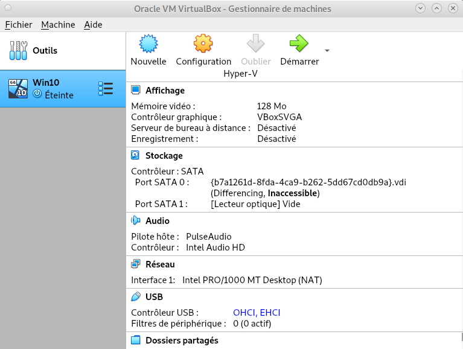

### 3 - Quel est le nom du fichier XML contenant la configuration de votre machine ?

Dans le fichier contenu dans les dossier de la machine virtuel : sae203.vbox-prev

### 4 - Sauriez-vous le modifier directement ce fichier pour mettre 2 processeurs à votre machine ?

Pour modifier le nombre ***cpu*** il faut aller a la ligne de **CPU count="1"** et remplacer le 2 par le nombre de processeur voulu.  
Pour le modifier on a utiliser des commandes système car on n'arrivé pas a modifier le fichier on a copié son contenu dans un fichier texte, puis modifier la ligne requise et enfin on a forcé le contenu du fichier texte dans le fichier sae203.vbox-prev  
  
il existe aussi un autre moyen de changer le nombre de cpu en allant dans les paramètres de la machine virtuel depuis VM VirutalBox.  


## 2 - L'installation de Debian.

---

Pour l'installation de Debian nous avions des paramètre a respecter :

* Nom de la machine (à l’installation) : serveur
* Domaine : Laisser vide
* Pays/langue : France
* Miroir : http://debian.polytech-lille.fr
* Proxy si nécessaire : http://cache.univ-lille.fr:3128
* Compte administrateur : root / root
* Un Compte utilisateur : User / user / user
* Partition : 1 seule partition recouvrant le disque entier
* Sélection des logiciels de démarrage (Paquetages logiciels à préinstaller pour se simplifier la vie par la suite) :

1. environnement de bureau Debian
2. MATE
3. serveur web
4. serveur ssh
5. utilitaire usuels du système

Maintenant la machine créer nous allons l'avons démarrer et VM VirtualBox nous a demander d'ajouter un fichier iso.  
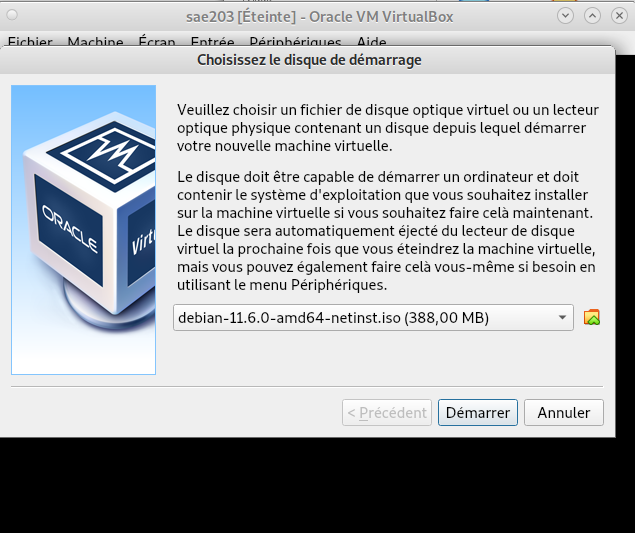

Une fois cela fait nous pouvons enfin procéder a l'installation de Debian.  
Nous avons choisit l'installation graphique.  


La première étape est le choix du nom de la machine.  


La deuxième est le choix du mot de passe de l'user root.  


Ensuite le choix du miroir.  


Et pout finir le choix des logiciel a installer. 

### 1 - Qu'est-ce qu'un fichier iso bootable ?

Un fichier iso bootable est un fichier image créé à partir d'un CD ou d'un DVD il contient les informations nécessaire pour démarrer un ordinateur.  
Iso : image CD

### 2 - Qu'est-ce que MATE ? GNOME ?

Mate est un environnement de bureau libre utilisant (dans un premier temps) la boîte à outils GTK+ 3.x et destiné aux systèmes d'exploitation apparentés à UNIX.  
Gnome à l'origine un acronyme pour GNU Network Object Model Environnent, est un environnement de bureau libre et open-source pour Linux et d'autres systèmes d'exploitation de type Unix[11].

### 3 - Qu'est-ce qu'un serveur web ?

Tout type de serveur qui permet de diffuser des contenues Web sur Internet ou Intranet

### 4 - Qu'est qu'un serveur ssh ?

SSH™ (ou Secure SHell) est un protocole qui facilite les connexions sécurisées entre deux systèmes à l'aide d'une architecture client/serveur et permet aux utilisateurs de se connecter à distance à des systèmes hôte de serveurs.

### 5 - Qu'est qu'un serveur mandataire ?

Un serveur mandataire filtre les sites Web que vous consultez. Il reçoit les requêtes de votre navigateur pour récupérer les pages Web demandées avec leurs éléments et, dans le respect des règles édictées, décide de vous les transmettre ou non.

## 3 - Configuration de Debian.

---

### Mettre l'user en droit sudo.

Passer en mode console : Ctrl + Alt + F1.  
Se connecter en root en utilisant les paramètre utiliser lors de l'installation de Debian dans notre cas: login = root et mot de passe root  
Puis ajouter le groupe sudo à votre principal grâce a la commande **$ sudo adduser "user" -G sudo**

### Installation des suppléments invités.

Pour ajouter les suppléments invités, nous allons devoir compiler des programmes. Il nous faut donc des outils de compilation et les fichiers d’en-têtes du noyaux linux utilisé :

Insérer le cd des suppléments : Périphériques › Insérer l’image CD des additions invités…  
Monter le CD avec la commande **sudo mount /dev/cdrom /mnt**  
Installer les suppléments en utilisant **sudo /mnt/VBoxLinuxAdditions.run**  
Puis rebooter votre machine est vous avez maintenant une machine utilisable.

### 1 - Comment peut-on savoir à quels groupes appartient l’utilisateur user ?

Il suffit d'utiliser la commande compgen -u

### 2 - A quoi servent les suppléments invités ?

Il permet l'intégration du pointeur de la souri, et la création de Dossiers partagé.

## 4 - L'histoire de Debian

---

*Avant d'utiliser Debian en profondeur, une petite introduction a son histoire s'impose !* 

### Question 1. Qu’est-ce que le Projet Debian ? D’où vient le nom  Debian  ?
[Debian](https://debian-facile.org/doc:debian) est un système d'exploitation **GNU/Linux** présentant deux caractéristiques principales :
- C'est la distribution **libre** qui offre le plus de stabilité pour les outils GNU et le noyau **Linux** .
 - C'est une distribution **non commerciale** suffisamment crédible pour concurrencer les distributions commerciales .

GNU/Linux Debian est également un système d'exploitation multi-plates-formes.

La [prononciation officielle](https://www.debian.org/doc/manuals/project-history/project-history.fr.txt) de Debian est **« déb-yann »**. Le nom tire son origine des prénoms du créateur de Debian, **Ian Murdock**, et de son épouse, **Debra**.

## 5 - La maintenance

---

### Question 2. Il existe 3 durées de prise en charge (support) de ces versions : la durée minimale, la durée en  support long terme (LTS) et la durée en support long terme étendue (ELTS). Quelle sont les durées de ces prises en charge ?
Effectivement il existe **3 durées de prise en charge** d'une version de Debian avec chacun leur type de version :

- **Durée minimal**, prise en charge environs **3 ans**.
- [LTS](https://wiki.debian.org/fr/LTS) (*support long terme*), prit en charge au moins **5 ans**.
- Et enfin, [ELTS](https://wiki.debian.org/fr/LTS/Extended) (*support long terme étendue*), prit en charge durant **10 ans**. 

### Question 3. Pendant combien de temps les mises à jour de sécurité seront-elles fournies ?

[L'équipe en charge de la **sécurité**](https://www.debian.org/security/faq.fr.html#lifespan) essaye de prendre en charge la distribution [stable](https://www.debian.org/releases/stable/) environ **une année** après que la version stable suivante a été publiée, sauf lorsqu'une autre distribution stable est publiée la même année. Il n'est **pas possible de prendre en charge trois distributions,** c'est déjà bien assez difficile avec deux.
<br/>

## 6 - Nom générique, nom de code et version

---

### Question 4. Combien de version au minimum sont activement maintenues par Debian ? Donnez leur nom générique (= les types de distribution).

Comme vu précédemment **différentes versions** sont activement maintenues par Debian, il y  a toujours **au moins trois versions** activement entretenues : ["stable"](https://www.debian.org/releases/stable/), ["testing"](https://www.debian.org/releases/testing/) et ["unstable"](https://www.debian.org/releases/sid/). 
<br/><br/>

### Question 5. Chaque distribution majeur possède un nom de code différent. Par exemple, la version majeur actuelle (Debian 12) se nomme bookworm. D’où viennent les noms de code données aux distributions ?

Jusqu'ici les [noms de code](https://www.debian.org/doc/manuals/debian-faq/ftparchives.fr.html#codenames) proviennent des personnages des films « [Toy Story](https://fr.wikipedia.org/wiki/Toy_Story) » par Pixar.
Voici un **tableau des noms** de code utilisé jusqu'à présent, ainsi que leurs signification :

| Version Debian | Nom | Signification |
| :---------------: |:---------------:| :-----:|
| Debian 1.1  |_buzz_|est le cosmonaute Buzz Lightyear|
| Debian 1.2  |_rex_|est le tyrannosaure|
| Debian 1.3  |_bo_| est Bo Peep, la bergère|
|Debian 2.0|_hamm_|est la tirelire en forme de cochon
|Debian 2.1|_slink_| est Slinky Dog, le chien
|Debian 2.2|_potato_| est bien sûr, Mr. Patate
|Debian 3.0|_woody_ |est le cowboy
|Debian 3.1|_sarge_ |est le sergent de l'armée de plastique vert
|Debian 4.0|_etch_ |est l'ardoise magique (Etch-a-Sketch)
|Debian 5.0|_lenny_ |est la paire de jumelles
|Debian 6|_squeeze_ |est le nom des extraterrestres à 3 yeux
|Debian 7|_wheezy_ |est le nom du manchot au nœud papillon rouge
|Debian 8|_jessie_ |est l'écuyère
|Debian 9|_stretch_ |est le nom de la pieuvre avec des ventouses sur ses tentacules.
|Debian 10|_buster_ | était le chien de compagnie d'Andy.
|Debian 11|_bullseye_| était le cheval de bois de Woody.
|Debian 12|_bookworm_ | était un ver de terre vert équipé d'un flash et qui adore lire des livres.
|Debian 13|_trixie_ | était un triceratops bleu en plastique
|Futur Debian|_sid_ |est le garçon des voisins qui casse tous les jouets.
<br/><br/>

### Question 6. L’un des atouts de Debian fut le nombre d’architecture (= processeurs) officiellement prises en charge. Combien et lesquelles sont prises en charge par la version Bullseye ?
[Debian 11](https://www.debian.org/releases/bullseye/) (*Bullseye*) prend en charge de **nombreuses architecture**, voici ci-dessous la liste des architectures officiellement prises en charge par Debian 11 :

- PC
	- 32 bits (i386) 
	- 64 bits (amd64)
- ARM
	- 64 bits (arm64)
	- EABI (armel)
	- ARMv7 (ARM avec unité de calcul flottant, armhf)
- MIPS
	- MIPS petit-boutiste (mipsel)
	- MIPS 64 bits petit-boutiste (mips64el)
-  PowerPC 64 bits petit-boutiste (ppc64el)
- IBM System z (s390x) 
<br/><br/>

### Questions 7. Première version avec un nom de code
- #### Quelle a était le premier nom de code utilisé ? 
	Le **premier** nom de code utilisé était [buzz](https://wiki.debian.org/fr/DebianBuzz), voir le tableau de la [Questions 5](#question-5.-chaque-distribution-majeur-possède-un-nom-de-code-différent.-par-exemple-la-version-majeur-actuelle-debian-11-se-nomme-bullseye.-doù-viennent-les-noms-de-code-données-aux-distributions).
- #### Quand a-t-il été annoncé ? 
	La [date](https://wiki.debian.org/fr/Debihttps://wiki.debian.org/fr/DebianBuzzanBuzz) d'annonce de la première version de Debian était le **17 juin 1996**.
- #### Quelle était le numéro de version de cette distribution ? 
	 **Debian 1.1** était effectivement la **première version** de Debian, voir  le tableau de la [Questions 5](#question-5.-chaque-distribution-majeur-possède-un-nom-de-code-différent.-par-exemple-la-version-majeur-actuelle-debian-11-se-nomme-bullseye.-doù-viennent-les-noms-de-code-données-aux-distributions). 
<br/><br/>

### Questions 8. Dernière nom de code attribué
- #### Quel est le dernier nom de code annoncée à ce jour ?
	A ce jour, la dernière version "*utilisable*", bien qu'instable, est [trixie](https://wiki.debian.org/fr/DebianTrixie). 
- #### Quand a-t-il été annoncé ?
	Elle a donc était annoncée le ***8 novembre 2020***.
- #### Quelle est la version de cette distribution ?
	La dernière version, représenté par *trixie* est **Debian 13**.

## 6 - Installation automatique et pré-configuration

---

### Introduction
*Maintenant que nous avant une connaissance accrue de Debian, et que l'on sait l'installer et l'utiliser. Il est intéressant de se pencher sur le déploiement a grande échelle de ce système d'exploitation.*

Afin d'[automatiser l'installation](https://www.debian.org/releases/stable/amd64/apb.fr.html), il nous faut utiliser un "*.iso*" différent et d'autres fichiers en plus.

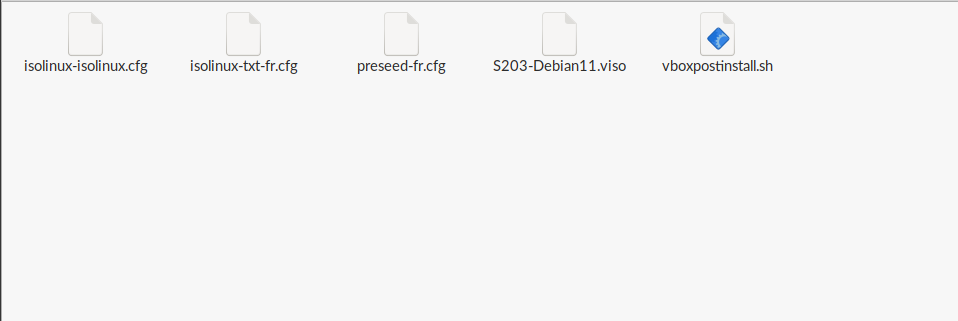

Ici le fichier de configuration automatisée pour une Debian (et ses dérivées) est le plus  
important. Il est souvent nommé  **preseed.cfg**, il est capable de faire s'executer **certaine commandes d'installations** automatiques a Debian.


### Premiere installation
On peut alors lancer l'installation d'une **nouvelle machine** à partir de Debian, et de des fichiers d'installations personnalisés.

L'installation étant déjà **configurée**, **aucune intéraction** avec l'utilisateur n'est nécessaire, l'installation est bien **automatique**.
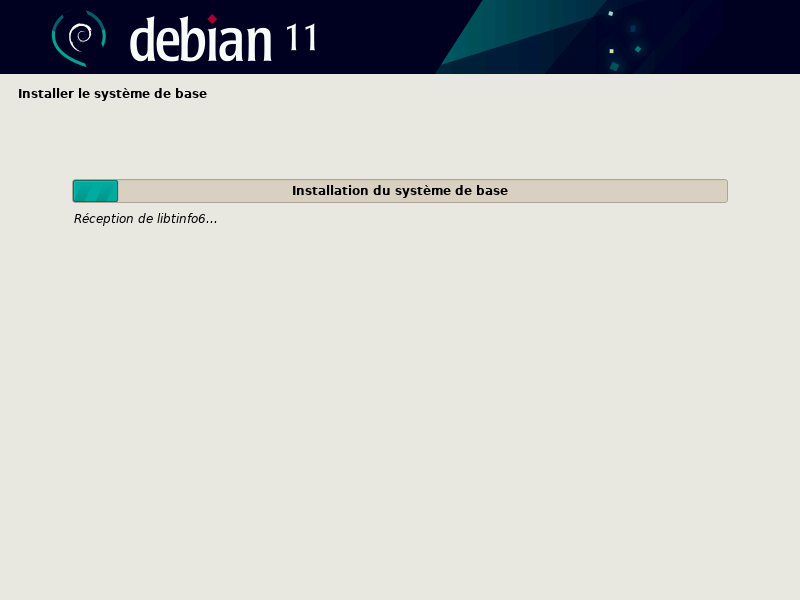
Mais, cette installation ne comporte aucune i**nterface graphique**, ni aucun **outil** dont nous avant besoin. Nous devrons alors modifier le fichiers **pressed.cfg** pour correspondre à nos besoins.

### Utilisateurs

Certains utilisateurs sont déja créer et configurés grace à **pressed.cfg**.

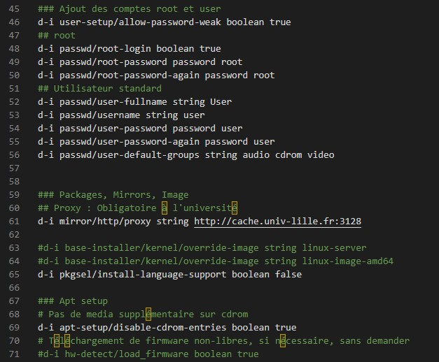

On peut vouloir ajouter les droits administrateurs à un utilisateur, les droits "**sudo**", représenté par un groupe d'utilisateur ayant ces droits. Il nous suffit donc de rajouter ***sudo*** dans les groupes de déja configurés.

La ligne :
``` 
d-i passwd/user-default-groups string audio cdrom video
```

Devient :
```
d-i passwd/user-default-groups string audio cdrom video sudo
```

### Environnement graphique

*Cet affichage en ligne pourrait paraitre hostère pour un utilisateur qui n'est pas informaticien, c'est alors logique que l'on cherche à rajouter un environnement graphique.*

Debian permet d'être configuré a l'avance avec un environnement graphique, ici on va utiliser **MATE**.
En utilisant la commande [***tasksel***](https://doc.ubuntu-fr.org/tasksel), qui est une application d'installation de logiciels faisant partie intégrante de l'installeur Debian. ***Tasksel*** regroupe les paquets à installer par tâches (ex. serveur LAMP, création audio, etc).

On peut alors utiliser *tasksel* pour rajouter **MATE**
Grace a la ligne :
```
tasksel tasksel/first multiselect standard mate-desktop
```

### Paquets supplementaires 

Evidemment une commande existe pour l'ajoute de "*paquet* supplementaires, ou tout autres programmes nécessaire.
</br>

[*pkgsel*](https://www.debian.org/releases/stretch/mips/apbs04.html.fr) fonctionne comme *tasksel*, mais pour les paquets.

Ici nous avons besoins de :
- Sudo *(sinon la gestion sudo est inutile)*
- Git
- Sqlite3
- Curl
- Bash-completions
- Neofetch 

Il nous suffit simplement d'ajouter ce dont nous avont besoin a la suite de :

```
d-i pkgsel/include string 
```

Ce qui donne :
```
d-i pkgsel/include string sudo git sqlite3 curl bash-completion neofetch
```

### Conclusion

Au final nous en avons apprit sur Debian et son histoire.
Mais nous avons aussi apprit à configurer une installation Debian, et a l'automatiser en modifiant **pressed.cfg** . Ce qui donne :


<br>
<br>

# Rapport semaine  8

---

*Dans cette partie de rapport, nous parlerons de comment fonctionne l'utilmisation de Gitea sur une machine virtuelle*

## 1 - Préliminaires.

---

*Précédemment, nous avons installé plein de services nécessaires à cette partie de la Saé, nous avons donc une machine virtuelle avec une Debian 11.6 avec au moins mate-desktop, git, et sqlite3 installé *   
 
### 1.1. Configuration globale de git.

Git est installé mais il n’est pas configuré, pour le configurer il faut :

1. Configurer le Prénom et le Nom
1. Configurer l'email
1. Configurer la branch git

Pour ceci nous entrons les commandes :

```
 git config --global user.name "Prénom Nom" 
 git config --global user.email "votre@email" 
 git config --global init.defaultBranch "master"  
```

Par la suite nous aurons besoin de git-gui et gitk  
Mais d'abord il est intéressant de se questionner sur leurs fonctionnement :

+ Qu'est-ce que le logiciel gitk ?  

[Gitk](https://www.atlassian.com/fr/git/tutorials/gitk#:~:text=gitk%20est%20un%20navigateur%20de,tous%20les%20syst%C3%A8mes%20d'exploitation.) est un navigateur de dépôt graphique. Il peut être considéré comme un encapsuleur graphique pour git log . Il permet d'explorer et de visualiser l'historique d'un dépôt. 

+ Comment se lance-t-il ?

L'exécution de la commande ***gitk**** lancera l'interface utilisateur de **gitk**, dans le terminal  

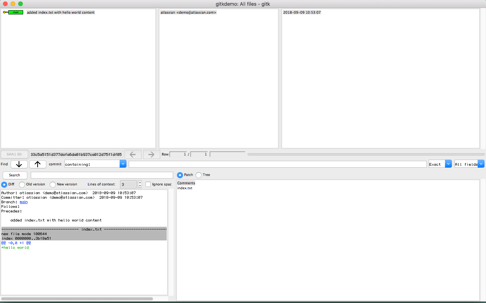


+ Qu'est -ce que le logiciel git-gui ?

C'est un interface graphique permettant d'utiliser git, de façon plus accessoble 

+ Comment se lance-il  

Pour lancer Git gui, il y a plusieurs possibilités. Soit en ligne de ccommande :  
git gui soit, sous debian via le menu alt+F2, puis ecrire ***git gui***.  

Pour installer git gui, on peut simplement utiliser apt :
 

# Rapport semaine 10

---

*Dans cette partie de rapport, nous parlerons de comment fonctionne l'utilmisation de Gitea sur une machine virtuelle*

## 1 - Préliminaires.

---

*Précédemment, nous avons installé plusieurs services nécessaires à cette partie de la Saé, nous avons donc une machine virtuelle avec Debian 11 et au moins mate-desktop, git, et sqlite3 installé *

Ici, nous nous intéresserons donc à l'installation de Gitea (voir section 2)

## 2 - L'installation de Gitea.

---

Tout d’abord, renseignons-nous sur le service Gitea

+ Qu’est-ce que Gitea ?

Gitea est un service Git auto-hébergé très simple à installer et à utiliser. Il est similaire à GitHub, Bitbucket ou Gitlab. Le but de ce projet est de fournir de la manière la plus simple, la plus rapide et sans complication un service Git auto-hébergé, fonctionnant sur toutes les plateformes , y compris Linux, macOS et Windows, même sur des architectures comme ARM ou PowerPC. [source :https://docs.gitea.io/fr-fr/]

+ À quels logiciels bien connus dans ce domaine peut-on le comparer (en citer au moins 2) ?

Gitea peut être comparé à :

+ Github
+ Bitbucket
+ Gitlab

### 2.1 Installation de Gitea

Gitea n’est pas installable sous forme de paquet debian mais il est quand même assez simple via de multiples solutions décrites dans la documentation [https://docs.gitea.io/] :

1. compilation des sources
2. récupération d’un binaire précompilé (utilisé ici)
3. via Docker

Nous allons donc installer Gitea avec un binaire précompilé.

### 2.1.1 Installation du binaire

Un site officiel [https://docs.gitea.io/en-us/install-from-binary/] permet de suivre cette installation en plusieurs étapes

Pour telecharger Gitea, la version de git doit être supérieure ou égale à 2.0, pour connaître la notre il faut faire git --version, ici git est suffisamment à jour

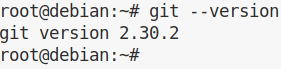

Il y a plusieurs façons de faire ce téléchargement:

+ soit en téléchargeant le fichier depuis le site, plusieurs version sont disponibles

 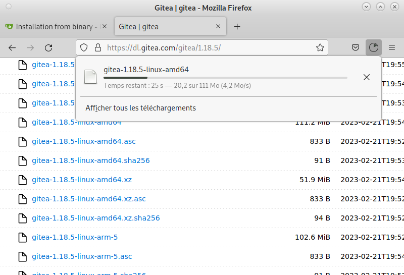

+ Soit en utilisant la commande wget[https://debian-facile.org/doc:reseau:wget],  qui fera une installation automatique selon la version demandé, ici nous utiliserons la version 1.21.7 .

**wget -O gitea https://dl.gitea.com/gitea/1.21.7/gitea-1.21.7-linux-amd64**

**chmod +x gitea**

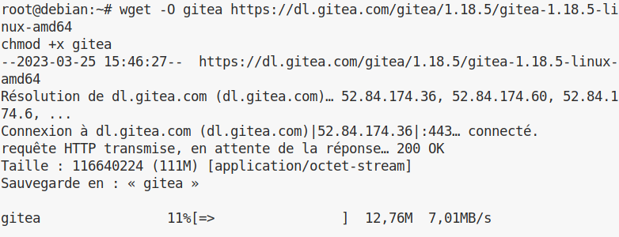

Cette installation a donc créé un fichier “gitea”, dans le fichier de l’utilisateur courant


Il est important de vérifier que l’installation est bien faite, nous allons vérifier la Signature GPG [https://doc.ubuntu-fr.org/gnupg#:~:text=GPG%20est%20l'acronyme%20de,vous%20%C3%A0%20la%20page%20Seahorse.], pour cela il faut utiliser les commandes

**gpg --keyserver keys.openpgp.org --recv 7C9E68152594688862D62AF62D9AE806EC1592E2**

**gpg --verify gitea-1.21.7-linux-amd64.asc gitea-1.21.7-linux-amd64**

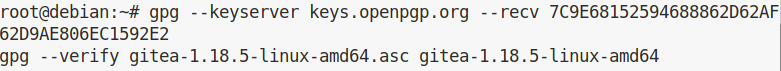

gitea pour démarrer, auras besoin d'un utilisateur qui pourra le démarrer, nous allons créer un utilisateur qui s'appelle "gitea" avec le mot de passe "gitea" et l'email "git@localhost".


Ainsi que son répertoire ainsi que les accès à celui ci


Et enfin l’export et la copie de ce répertoire, pour en faire la configuration

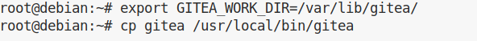

A partir de maintenant, Gitea est fonctionnel est utilisable, nous devons utiliser l’utilisateur précédemment créé pour le lancer

### 2.1.2 Mise à jour du binaire du service Gitea

+ Quelle version du binaire avez-vous installé ? Donnez la version et la commande permettant d’obtenir cette information.

La version de Gitea actuellement installée est la version 1.21.7, nous pouvons vérifier la version via la commande

**gitea -v**

+ Comment faire pour mettre à jour le binaire de votre service sans devoir tout reconfigurer ? Essayez en mettant à jour vers la version 1.22-dev.

Le site officiel nous guide pour la mise a jour de Gitea[https://docs.gitea.io/en-us/upgrade-from-gitea/]

Nous nous intéresserons à la mise a jour avec un Gitea en fichier binaire, il faut :

+ Téléchargez le binaire de Gitea pour la version 1.22-dev dans un répertoire temporaire.
+ Arrêtez l'instance en cours d'exécution, sauvegardez les données.
+ Remplacez le binaire Gitea installé par celui téléchargé.
+ Remplacez le binaire Gitea installé par celui téléchargé.

Et voilà, notre Gitea est à jour.


